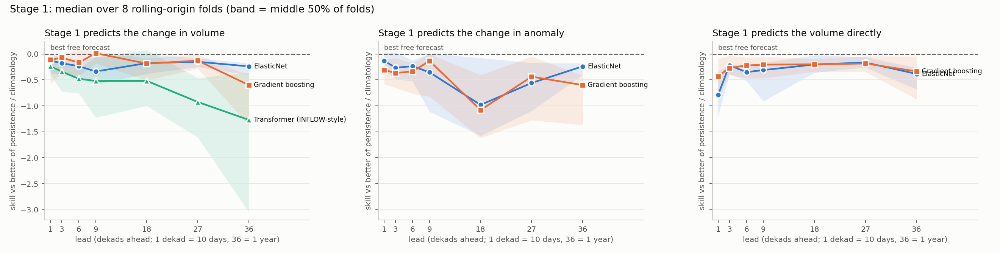
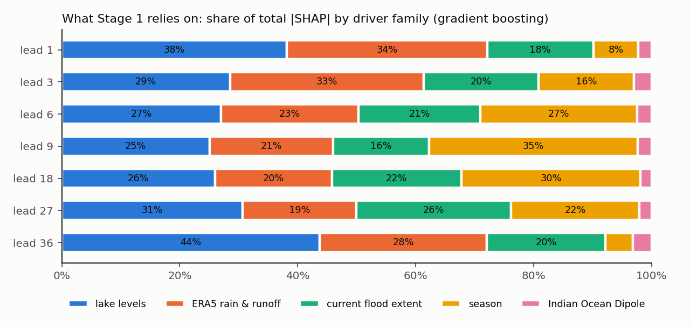
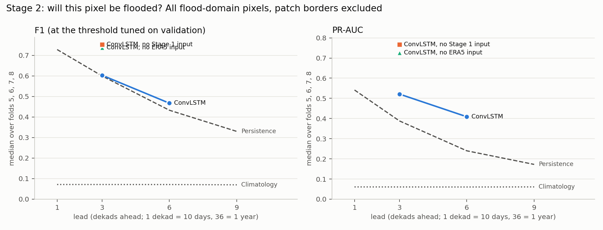
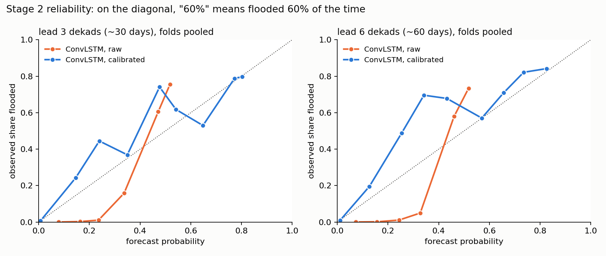

**Status.** All runs in this report are complete: Stage 1 at seven leads (10 days to 12 months), Stage 2 at leads of 3 and 6 dekads (~1 and ~2 months) on folds 5-8, plus two Stage 2 ablations and the calibration of Stage 2's probabilities (section 5.4).

# Summary

- **Question.** How far ahead can flooding in the Unity / Jonglei / Upper Nile corridor be forecast, pixel by pixel, better than forecasts that need no model at all?
- **Approach.** A two-stage design adapted from INFLOW-AI v2.1 and retrained from scratch on our own data. Stage 1 forecasts *how much* of the corridor floods; Stage 2 forecasts *which pixels* (~232 m).
- **Evaluation.** Every model is compared with two free forecasts: **persistence** ("same as now") and **climatology** ("same as usual for this time of year"). All tests use eight rolling-origin folds: the model only ever trains on years before the ones it is tested on.
- **Stage 1 result.** Across leads from 10 days to 12 months, no model beats the better free forecast consistently. The best case is gradient boosting at ~3 months, roughly level with it. In the fold trained only on 2000-2019 and tested on the 2020-21 floods, however, it beats both free forecasts at 1-3 months (+6% to +16%).
- **Stage 2 result.** At ~1 month ahead, the ConvLSTM matches persistence on F1 and is clearly better at **ranking pixels by risk** (PR-AUC 0.18-0.74 against 0.08-0.55, better in all four test periods). At ~2 months ahead the gap widens: it beats persistence on F1 in all four periods (0.16-0.70 against 0.15-0.65) and on PR-AUC by 0.13-0.23 in the three flood-heavy periods. After a two-number calibration step its probabilities also beat both free forecasts on the Brier score in all eight lead-fold combinations.
- **What drives the model.** Lake levels are the input the model relies on most, and within the lakes, levels from **10-18 months earlier** carry the most weight at leads of a month or more. That matches the ~9-17 months Lake Victoria water needs to reach the Sudd.
- **Where next.** Two routes, described in section 7: a **seasonal outlook** (will next season's flood peak be above normal?), and a **short-range, impact-based warning** (which payams have the most people at risk in the next 10-30 days?).

# 1. The problem

The Sudd floods every year; that is normal. Since 2020 flooding has been on a different scale: in the corridor, flooded area per year is about **16 times** the 2000-2019 average, with 2023 the largest year on record. Humanitarian partners (ZOA, Zero Hunger Lab) want to know whether such floods can be seen coming early enough to act.

NASA's flood product labels every flooded pixel as **recurring** (floods in at least about a third of years) or **unusual** (floods less often). In our corridor 99% of the pixels that ever flood are "unusual", so in practice the label is close to a fixed map. We therefore forecast **flooded / not flooded**, and report results separately for recurring and unusual pixels.

# 2. Data

| data | source | used for |
|---|---|---|
| Flood masks | NASA MCDWD, daily 3-day composites, ~232 m, 2000-2025 | the target |
| Lake levels | satellite altimetry: Victoria, Kyoga (1992-), Albert (2002-) | Stage 1 |
| Indian Ocean Dipole (DMI) | NOAA PSL, monthly | Stage 1 |
| Rainfall and runoff | ERA5 reanalysis, hourly, 0.25 deg, Nile basin | Stages 1 and 2 |
| Admin boundaries | county (admin-2) polygons | defining the corridor |

Everything is aggregated to **dekads** (10-day periods, 36 per year), the cadence INFLOW-AI and FEWS NET use for East Africa: 936 dekads from 2000 to 2025.

The **flood domain** is the ~1.08 million pixels that flooded at least once. About 76% of the corridor never flooded and is left out: a model that learns "predict dry" there would look accurate and say nothing.

ERA5 rainfall is summarised over five regions along the river system: the Lake Victoria catchment, Kyoga/Albert, Bahr el Jabal, the Sobat / Ethiopian highlands, and the corridor itself. As a check, annual totals come out at ~1,700 mm over Lake Victoria and ~750 mm over the corridor.

# 3. How the model developed

**18-20 September: tabular baselines.** Following FEWS NET, we fitted ElasticNet and gradient boosting on monthly corridor flood totals with lagged lake levels and DMI (2003-2024). Both beat calendar-month climatology; persistence remained the stronger reference.

**21 September: adopting the INFLOW-AI v2.1 architecture.** We inspected the released v2.1 models (a transformer for the corridor total, a ConvLSTM for the map) and decided to adapt the architecture, not the weights, and retrain it on our own corridor and target.

**22 September: first ConvLSTM.** A spatial model on native-resolution 32 x 32 patches, restricted to the flood domain, with a three-class output (no flood / recurring / unusual). Scored on three test years against a per-pixel climatology, it recovered unusual floods well (F1 0.52 / 0.85 / 0.77 in 2019 / 2023 / 2025). We also tried adding lake and DMI inputs and tuning class thresholds; neither helped consistently.

**23-24 September: from a first model to a forecasting system.** Reviewing that model led to four changes in method:

1. **Real lead times.** The first model forecast one dekad ahead from the previous six. Useful early warning needs longer leads, so every model is now run at explicit leads from 1 to 36 dekads (10 days to a year).
2. **Stronger reference forecasts.** Against persistence, the first model scored about the same (unusual F1 0.50 / 0.84 / 0.77 for persistence against 0.52 / 0.85 / 0.77). One dekad ahead, the flood map barely changes. Persistence, and a proper seasonal climatology, are now part of every result.
3. **A binary target.** Since recurring/unusual is almost fixed per pixel, the model now predicts flooded / not flooded, and the NASA class is used to split the scores.
4. **Rolling-origin testing.** Three test years became eight folds, each training only on earlier years, so every test is a genuine forecast.

**24 September: the current pipeline.** Built in `prediction/` (section 8), adding ERA5 rainfall and runoff and long lake lags, and running both stages across all folds and leads.

# 4. The current design

**Stage 1: how much.** Target: flooded domain pixels at dekad t + L, forecast at t from data up to t. Features: lake level anomalies and changes (lags up to 18 months), DMI, ERA5 anomalies and rain totals per region, current flood extent, and season. Models: ElasticNet, gradient boosting, and INFLOW's transformer (one attention block, 8 heads, 36-dekad window). Explained with TreeSHAP.

**Stage 2: where.** A ConvLSTM reads the last 6 dekads for each 32 x 32 patch and outputs the probability that each pixel is flooded at t + L. Input channels follow INFLOW's layout: flood history, rainfall, runoff, flood-domain mask, plus Stage 1's forecast. Output: one sigmoid channel, as in INFLOW.

**Testing.** Eight folds: train 2000-2009 and test 2010-11, train 2000-2011 and test 2012-13, and so on up to a test on 2024-25. Fold 6 trains only on 2000-2019 and is tested on 2020-21: it asks whether the crisis could have been seen coming.

**Safeguards**, checked automatically by `prediction/test_pipeline.py`:

- a 6-dekad gap between the last training sample and the first test sample;
- seasonal averages and scalings computed from each fold's training years only;
- Stage 1 values given to Stage 2 come only from Stage 1 models trained on earlier years;
- every model result is stored next to persistence and climatology at the same lead and fold;
- fixed random seeds and deterministic GPU operations.

**Reference forecasts.** *Persistence*: the value at the issue time. *Climatology*: the usual value for that dekad of the year in the training years. For Stage 1 we also report *seasonal persistence*: today's departure from normal carries on and the season does the rest.

**Headline score.** Per fold: 1 minus the model's error divided by the error of the **better** of persistence and climatology. Above zero means the model adds something over the best free forecast. Beating only the weaker of the two is not counted as skill, because climatology is weak at short leads and persistence at long ones.

# 5. Results

## 5.1 Stage 1: flood volume

Default target (change in flood volume), skill against the better free forecast:

| lead | ~time | gradient boosting: folds won | median skill | fold 6 (2020-21) | ElasticNet: folds won | transformer: folds won |
|---|---|---|---|---|---|---|
| 1 | 10 days | 2/8 | -0.11 | -0.51 | 3/8 | 0/8 |
| 3 | 1 month | 2/8 | -0.07 | **+0.06** | 1/8 | 2/8 |
| 6 | 2 months | 3/8 | -0.16 | **+0.16** | 1/8 | 1/8 |
| 9 | 3 months | **5/8** | **+0.01** | **+0.05** | 2/8 | 2/8 |
| 18 | 6 months | 1/8 | -0.19 | -0.09 | 2/8 | 3/8 |
| 27 | 9 months | 2/8 | -0.13 | +0.05 | 1/8 | 1/8 |
| 36 | 12 months | 1/8 | -0.60 | -0.11 | 0/8 | 1/8 |

- No model beats the best free forecast consistently. Gradient boosting at 3 months is level with it.
- The **2020-21 fold** is the exception: gradient boosting beats both free forecasts at 1-3 months. The model helps most in the years that matter, and adds little in normal years, where climatology is already very good. This is a single fold, so it is a lead to follow, not a proven result.
- Longer leads (6-12 months) do not help, despite the long lake lags.
- **INFLOW's transformer** is the weakest model at almost every lead. With ~700 training dekads, a model of that size overfits. On a record this short, the smaller tree model is the better choice.
- Two other targets were tested and are in `tables/stage1_skill.csv`: predicting the **volume directly** fails in 2022-23 (tree models cannot predict above anything seen in training), and predicting the **change in anomaly** scores worse on average, though +22% in fold 6 at 2 months.

## 5.2 What Stage 1 relies on

- **Lake levels** are the largest or second-largest family at every lead (25-44%). ERA5 rainfall and runoff lead at 1 month, season at 3-6 months. DMI adds little (2-3%).
- Within the lakes, the **10-18-month lags** carry the most weight at every lead from 1 month to 12 months (at 10 days, the most recent levels matter more). The model picked out the ~9-17-month transit from Lake Victoria to the Sudd without being told.
- Importance is not the same as skill: the model uses the lakes, but that has not yet been enough to beat the free forecasts across all folds.

## 5.3 Stage 2: which pixels

Lead 3 (~1 month), all flood-domain pixels:

| test years | F1 ConvLSTM | F1 persistence | PR-AUC ConvLSTM | PR-AUC persistence | Brier ConvLSTM | Brier persistence |
|---|---|---|---|---|---|---|
| 2018-19 | 0.275 | 0.285 | **0.177** | 0.083 | 0.032 | 0.004 |
| 2020-21 | 0.473 | 0.468 | **0.365** | 0.229 | 0.040 | 0.016 |
| 2022-23 | 0.733 | 0.731 | **0.678** | 0.548 | 0.072 | 0.026 |
| 2024-25 | 0.754 | 0.735 | **0.744** | 0.551 | 0.050 | 0.024 |

Climatology scores F1 0.04-0.15 in every period and is far behind both.

- On **F1** (a yes/no forecast at one threshold) the ConvLSTM is level with persistence.
- On **PR-AUC** it is better in all four periods, by 0.09 to 0.19. It is good at telling *which* pixels are more at risk than others, which persistence cannot do. For planning, that is what allows areas to be ranked by priority.
- On the **Brier score** (quality of the probability itself) it is worse: a "60%" from the model does not yet mean 60%. This can be corrected with a calibration step fitted on the validation years, without retraining. Section 5.4 does this.
- Results are almost the same on unusual pixels. On the few recurring pixels, the ConvLSTM is better on PR-AUC and Brier.

Lead 6 (~2 months), all flood-domain pixels:

| test years | F1 ConvLSTM | F1 persistence | PR-AUC ConvLSTM | PR-AUC persistence | Brier ConvLSTM | Brier persistence |
|---|---|---|---|---|---|---|
| 2018-19 | **0.157** | 0.149 | 0.065 | 0.025 | 0.027 | 0.005 |
| 2020-21 | **0.289** | 0.241 | **0.204** | 0.071 | 0.049 | 0.022 |
| 2022-23 | **0.645** | 0.625 | **0.613** | 0.409 | 0.085 | 0.036 |
| 2024-25 | **0.696** | 0.648 | **0.662** | 0.436 | 0.077 | 0.031 |

- Two months ahead, persistence weakens faster than the ConvLSTM. The model now wins on **F1 in all four periods** (by 0.01 to 0.05) and on **PR-AUC** by 0.13 to 0.23 in the three periods with large floods.
- 2018-19 is the exception on PR-AUC: flooding was small, and climatology (0.073) ranks pixels slightly better than the model (0.065).
- The Brier score is still worse than persistence, for the same reason as at lead 3: the raw probabilities are too high (section 5.4 fixes this).
- On unusual pixels the pattern is the same (F1 0.09 / 0.26 / 0.65 / 0.70 against 0.08 / 0.22 / 0.63 / 0.65). On recurring pixels the ConvLSTM also beats persistence on Brier in every period.

**Do the extra inputs help?** Two ablations, lead 3, tested on 2024-25 (one fold, one seed each):

| model | F1 | PR-AUC | Brier |
|---|---|---|---|
| ConvLSTM, all inputs | 0.754 | 0.744 | 0.050 |
| without the Stage 1 input | 0.753 | **0.767** | 0.050 |
| without the ERA5 inputs | 0.737 | 0.726 | 0.066 |
| persistence | 0.735 | 0.551 | 0.024 |

- **ERA5 rainfall and runoff help a little.** Without them all three scores get worse, and F1 drops almost to persistence.
- **Stage 1's forecast does not help Stage 2 at this lead.** Removing it leaves F1 unchanged and PR-AUC slightly higher. This is consistent with Stage 1 not beating the free forecasts (section 5.1): the flood maps Stage 2 already reads contain what Stage 1 knows about volume.
- Both differences are small and come from one test period and one seed, so they point in a direction rather than settle the question.

## 5.4 Stage 2 calibration: making "60%" mean 60%

The raw ConvLSTM's probabilities are too high on purpose: training uses a focal loss (which rewards ranking pixels, not honest percentages) and batches that are half flooded patches, far more water than the real 0.1-4% base rate. So we added a **calibration** step (`prediction/11_calibrate_stage2.py`), without retraining. For each run it fits two numbers on the validation years (Platt scaling: a logistic curve on the model's own output) and applies them to the test years. The curve only rises, so the order of pixels, and therefore F1, is unchanged. Only the probability values move.

Brier score, all flood-domain pixels (lower is better). Skill = 1 - Brier / Brier of the better free forecast:

| lead | test years | raw | calibrated | persistence | climatology | skill |
|---|---|---|---|---|---|---|
| 3 | 2018-19 | 0.032 | **0.0025** | 0.0039 | 0.0028 | +0.10 |
| 3 | 2020-21 | 0.040 | **0.013** | 0.016 | 0.015 | +0.14 |
| 3 | 2022-23 | 0.072 | **0.024** | 0.026 | 0.049 | +0.08 |
| 3 | 2024-25 | 0.050 | **0.018** | 0.024 | 0.044 | +0.26 |
| 6 | 2018-19 | 0.027 | **0.0027** | 0.0045 | 0.0028 | +0.05 |
| 6 | 2020-21 | 0.049 | **0.015** | 0.022 | 0.015 | +0.01 |
| 6 | 2022-23 | 0.085 | **0.032** | 0.036 | 0.049 | +0.11 |
| 6 | 2024-25 | 0.077 | **0.022** | 0.031 | 0.044 | +0.31 |

- After calibration the ConvLSTM **beats both free forecasts on Brier in all eight** lead-fold combinations. Brier was the only score it lost before, so Stage 2 now beats persistence on every score at ~2 months, and on PR-AUC and Brier at ~1 month.
- The gain is smallest in the crisis fold (2020-21, +0.01 at lead 6) and largest in 2024-25 (+0.26 / +0.31).
- The reliability curves are much closer to the diagonal, but the calibrated model still **under-forecasts in the 10-50% range**: pixels given 20-35% flooded 45-70% of the time. The two validation years are drier than most test years, and a calibrator can only be as right as the years it learnt from. Read mid-range probabilities as a lower bound.
- PR-AUC after calibration differs from the raw value by up to 0.03 (0.034 in 2020-21 at lead 6). This comes from how it is computed (a 200-bin probability histogram; calibration squeezes most pixels into the lowest bins), not from a change in ranking. F1 is identical, which confirms the order is kept. PR-AUC in section 5.3 is from the raw probabilities.

# 6. What the data tell us

1. **Water moves slowly.** A pixel flooded today is usually still flooded a month later, which makes persistence very hard to beat at short leads.
2. **Flooding is seasonal.** At leads of several months, "same as usual for this time of year" is already a good forecast.
3. **There is essentially one regime change.** The post-2019 floods followed a ~1 m rise in Lake Victoria between 2019 and 2020. In 26 years of data this happened once. Learning "how a crisis starts" from one example is hard for any model.
4. **The lakes carry a real signal, mainly in unusual years.** The model uses 10-18-month lake lags and, in the 2020-21 fold, beats both free forecasts. In calm years there is little left to gain.
5. **Scoring every dekad hides the signal.** Averaged over all dekads, the score is dominated by normal periods. The event that matters for anticipatory action, an unusually large flood season, carries little weight in that average.
6. **Local detail is learnable.** Stage 2's better pixel ranking shows that the spatial pattern of flooding carries information beyond "same as now", and its edge over persistence grows from ~1 to ~2 months ahead.

# 7. Where to go next

## 7.1 Route A: seasonal outlook

Change the question to the one early action is planned around:

> *In 3-6 months, will this season's flood peak be below, near or above normal, and with what probability?*

This is the format of East African seasonal outlooks (ICPAC's GHACOF) and of anticipatory-action triggers ("act if the probability of above-normal exceeds X"). The lake signal should matter most here, because lakes integrate months of rainfall.

- **Target:** peak flooded area per season, in terciles (below / near / above normal) or above a threshold.
- **Model:** a small set of physically chosen predictors (lake anomalies at 9-15 months, seasonal rainfall anomalies, DMI) with logistic regression and gradient-boosted classification. Few predictors, because there are only ~25 seasons.
- **Scores:** Brier skill score and ROC-AUC against climatology, plus a reliability diagram ("when we say 70%, does it happen 70% of the time?").
- **Map:** the seasonal outlook combined with analogue maps: where did it flood in past seasons of similar size?

## 7.2 Route B: short-range, impact-based warning (10-30 days)

At leads of 1-3 dekads, Stage 2 is already competitive and ranks pixels well, and at ~2 months it beats persistence outright. The step that would make it useful on the ground is to turn pixel probabilities into **people and places**:

1. **Calibrated** probabilities (section 5.4, done): Stage 2's percentages can now be used as probabilities, with the caveat that they run low in the 10-50% range.
2. **Add forecast rainfall.** Today the model only knows past rainfall. Adding the ECMWF 15-day ensemble forecast, or GloFAS river-flow forecasts, gives it information about the coming weeks.
3. **Aggregate to exposure.** Combine the probability map with WorldPop population and the payam (admin-3) boundaries already in this repository, giving *expected people in flooded pixels per payam*, with uncertainty.
4. **Output:** a ranked list and map of the payams most at risk in the next 10-30 days, updated every dekad. Scored on whether the top-ranked payams are the ones that flood (hit rate in the top 10), which is what matters to a team deciding where to preposition supplies.

This route builds on work already done (Stage 2, WorldPop and payam analyses in `eda/`) and gives a concrete product for the time scale on which evacuation and prepositioning decisions are taken.

## 7.3 Data that would help

| data | what it adds | effort |
|---|---|---|
| Seasonal rainfall forecasts (C3S / ECMWF SEAS5) | information about future rainfall, the missing piece for Route A | ~1 day |
| GloFAS river-flow reanalysis and forecasts | White Nile inflow upstream of the Sudd (e.g. Mongalla) and the Sobat, which we do not measure now | ~0.5 day |
| ERA5-Land soil moisture | how saturated the ground already is (INFLOW uses it) | ~0.5 day |
| JRC Global Surface Water, monthly 1984-2021 | 16 more years of flood history, i.e. more unusual years to learn from | 1-2 days |
| ECMWF 15-day ensemble | forecast rainfall for Route B | ~1 day |
| Sentinel-1 radar | sees through clouds, for better labels | later |

GloFAS and GSWE were ruled out earlier as *model backbones*. Here they would only serve as inputs and as extra labels; that is a different use and should be agreed as a team.

## 7.4 Planned steps

1. Done: Stage 2 lead-6 runs, ablations (section 5.3) and calibration (section 5.4).
2. Agree the question for the next round (Route A, Route B, or both) and **write down the targets, thresholds and scores before running it**, so that results cannot steer the method.
3. Download the new data for the chosen route.
4. Build the seasonal model (A) and/or the payam ranking (B).
5. Report both the results above and the new ones.

A possible outcome is that beyond one to two months nothing beats climatology except in years when Lake Victoria is very high. For this project that is still a useful result: it states what an early-action trigger can and cannot rely on.

# 8. Code and reproducibility

All code is in `prediction/`, with a step-by-step guide and glossary in `prediction/README.md`.

| step | script | what it does |
|---|---|---|
| 1-3 | `01_domain_mask.py`, `02_extract_pixels.py`, `03_dekadal_labels.py` | flood domain and labels per pixel and dekad |
| 4-5 | `04_era5_basin_features.py`, `05_driver_table.py` | ERA5, lake and DMI series per dekad |
| 6 | `06_stage1_volume.py` | Stage 1 models, scores and SHAP |
| 7-8 | `07_dense_arrays.py`, `08_train_stage2.py` | patches and Stage 2 training |
| 9 | `09_baselines.py` | persistence and climatology per pixel |
| 10 | `10_evaluate.py` | the tables and figures in this report |
| 11 | `11_calibrate_stage2.py` | calibrated Stage 2 probabilities (then step 10 again) |

- Runs on Windows, macOS and Linux with Python 3.12 or 3.13 after `pip install -r requirements.txt` (TensorFlow has no Python 3.14 build yet, and none for Intel Macs). `prediction/test_pipeline.py` checks the pipeline in a few seconds. Setup and two ways to reproduce (quick from shared intermediate files, or full rebuild) are in `prediction/README.md`. A fresh clone with a clean environment reproduced the Stage 1 results exactly.
- Data and intermediate files (~3.6 GB) live in `raw_data/` and are not tracked by git.
- Result tables are in `deliverables/tables/` (`stage1_skill.csv`, `stage2_skill.csv`, `stage2_calibration.csv`, `stage1_shap.csv`, `skill_summary.csv`).
- This page is built from `deliverables/MODEL_REPORT.md` with pandoc (command at the end of `prediction/README.md`).

# 9. Limitations

- NASA's product does not distinguish "dry" from "not observed" (for example under cloud). No detection is treated as dry.
- The flood tiles stop at 10 N; the northern tip of Upper Nile is not covered.
- ERA5 regions are rectangles, not catchment boundaries.
- There is no elevation input. The Sudd is very flat, and global elevation data would be less accurate than the relief itself.
- The recurring / unusual map is built by NASA from the full record, so it is used only to split scores, never as an input.
- Stage 2 trains on a sample of (patch, dekad) pairs (2-3% per run, recorded in each run log); test scores always use all pairs.
- Stage 1's default target (the change in flood volume) was chosen after comparing it with the direct-volume target on the test folds. All three targets are reported.
- Results come from one corridor and 26 years containing one major regime change; conclusions about other regions or future regimes should be drawn with care.
